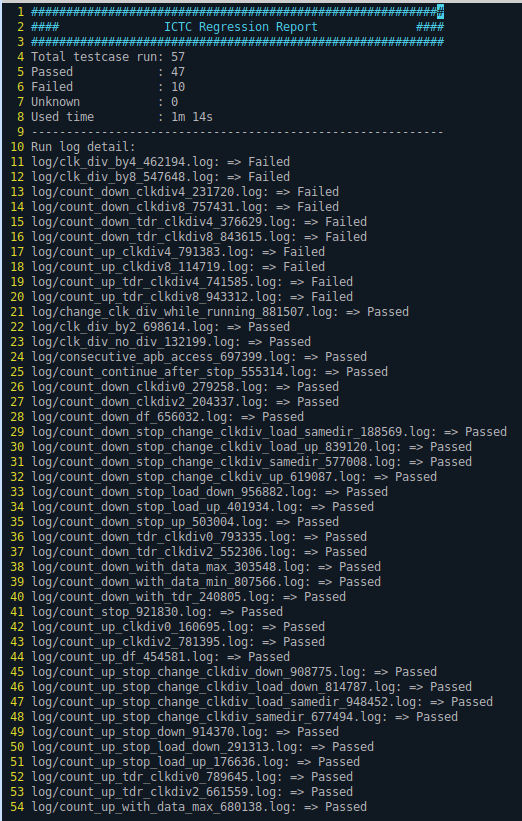
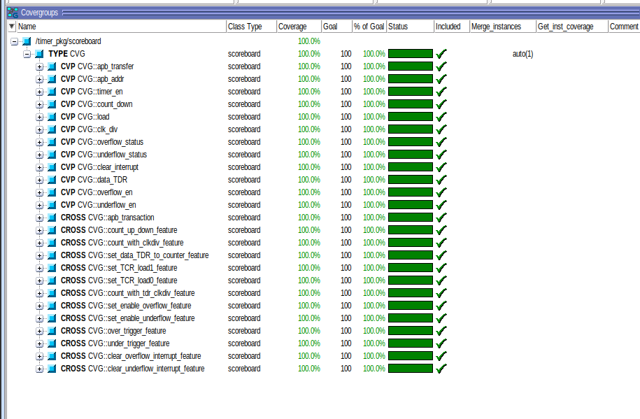

# 8-bit Timer — Verification

## Overview
Class-based (non-UVM) verification environment for an **8-bit programmable Timer** with APB-like register interface.

The testbench verifies timer counting (up/down), clock divider configurations, load functionality, interrupt generation (overflow/underflow), register access, and various corner-case scenarios.

## Architecture
```
+----------------+       +-------------+       +-----------+
|   Test Cases   | ----> | Environment | ----> | Timer DUT |
| (52 directed)  |       | (Class-based)|      | (RTL)     |
+----------------+       +-------------+       +-----------+
                               |
                    +----------+----------+
                    |                     |
              +-----------+      +----------------+
              | Scoreboard|      | Coverage Model |
              +-----------+      +----------------+
```

## Key Features
- **Class-based methodology** with driver, monitor, scoreboard
- **Embedded functional coverage** in scoreboard (covergroups for APB transfers, timer control, status, interrupts)
- **Self-checking scoreboard** with reference model for timer counting, overflow/underflow detection
- **52 directed test cases** organized by feature
- **Regression automation** via Perl script + Makefile

## Register Map
| Register | Address | Description |
|----------|---------|-------------|
| TCR | 0x00 | Timer Control (enable, direction, load, clk_div) |
| TSR | 0x01 | Timer Status (overflow, underflow flags) |
| TDR | 0x02 | Timer Data Register |
| TIE | 0x03 | Timer Interrupt Enable |

## Directory Structure
`
project1/
├── tb/             # Environment, scoreboard, driver, monitor
├── testcase/       # 52 directed test cases
└── sim/            # Makefile, regression scripts
`

## Results

### Regression
All **52/52** test cases passed.



### Functional Coverage



## Tools
- **Simulator**: QuestaSim / ModelSim
- **Language**: SystemVerilog
